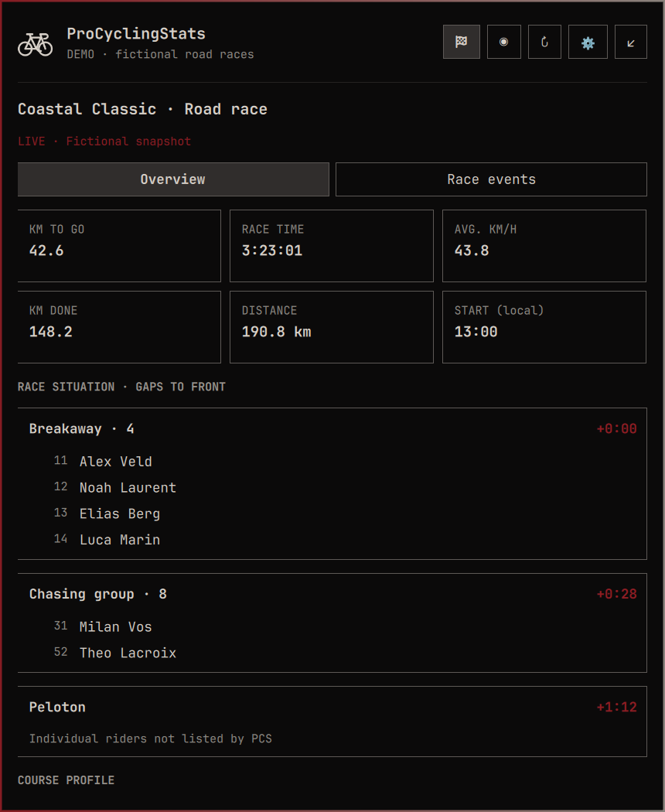
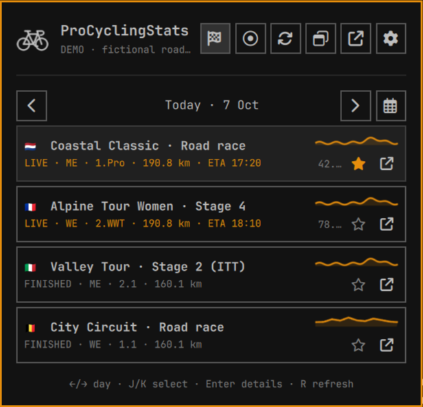
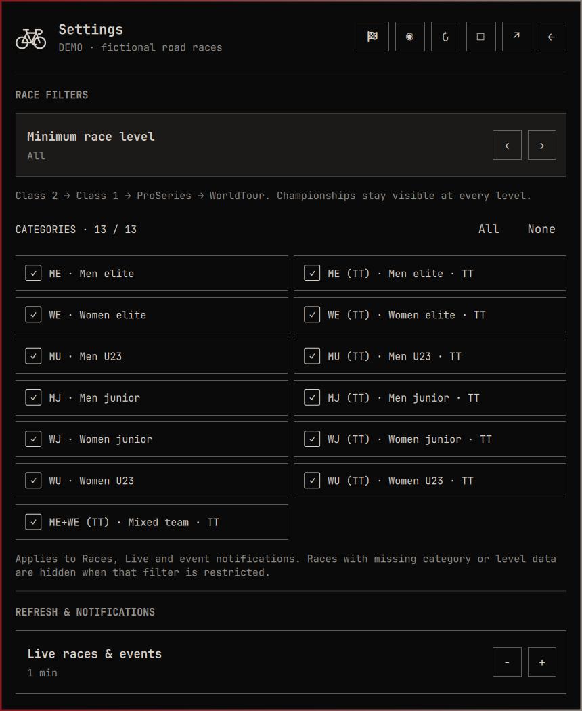
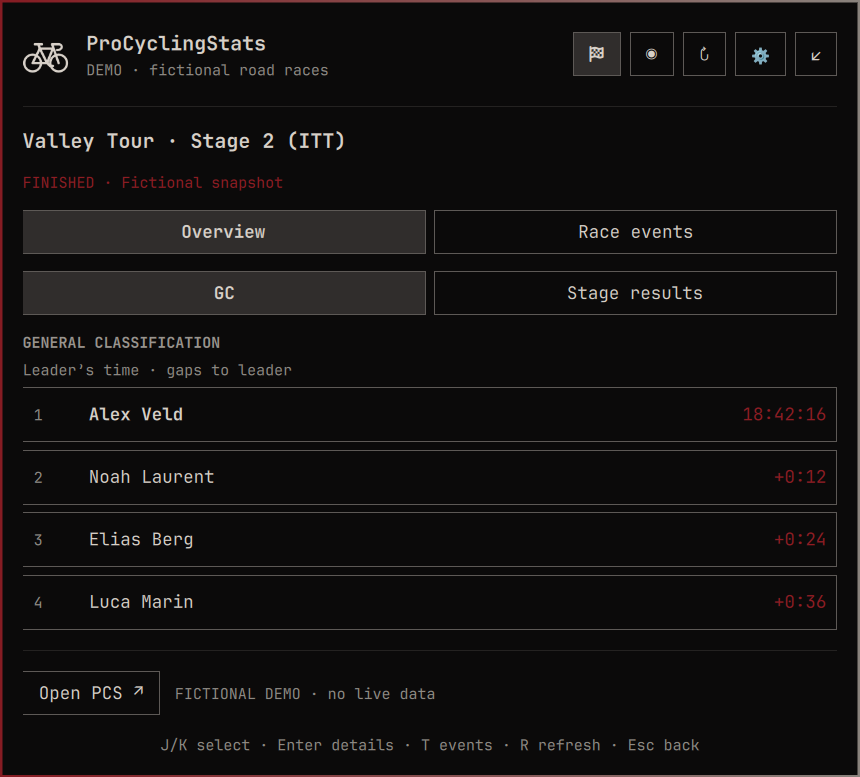
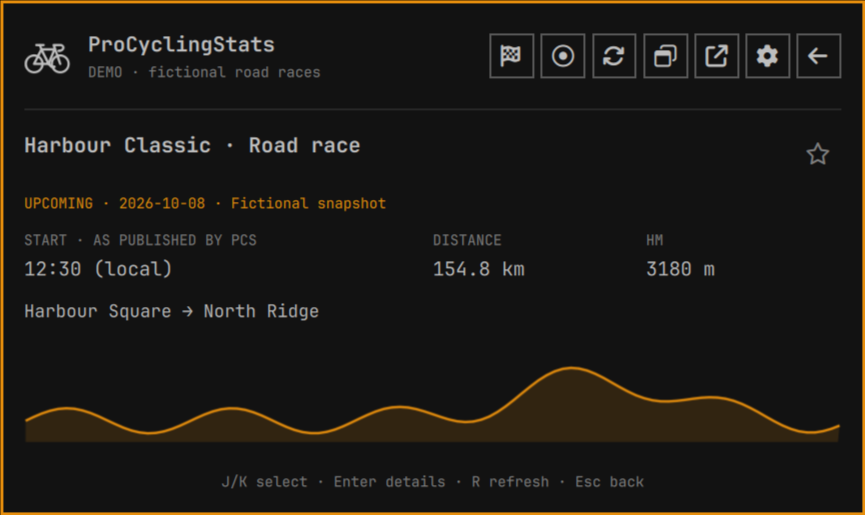

# ProCyclingStats for Omarchy

A compact road-cycling dashboard for the Omarchy Quattro bar. Follow the race
situation, time gaps and latest events without keeping a browser window open.

**Unofficial integration.** Not affiliated with or endorsed by ProCyclingStats.
Race coverage depends on the public data PCS makes available.



## Features

- **Pop-out window:** detach into a regular tiled window and dock back without
  losing your current view; polling and notifications stay shared.
- **Yesterday, today and tomorrow:** results, current races and upcoming stages.
- **Profiles and distance:** published elevation thumbnails and kilometres for
  past, current and upcoming races; larger profiles in the details view. Profiles
  and distances survive shell restarts in a seven-day disk cache.
- **Race calendar:** browse recent results and upcoming races beyond adjacent days.
  Choose the default list size in Settings (25 races; adjustable from 10 to 100).
- **One race overview:** distance remaining, race time, average speed, groups and
  rider splits, latest events, course profile and the next published climb or sprint.
- **Finished races:** course profile, distance, winner’s time and average speed,
  alongside final results and the selected stage’s GC with time gaps.
- **Race events:** attacks, sprints, dropped riders, abandonments and finish updates.
- **Your races:** 13 independent category checkboxes and a minimum race level.
  Choose ProSeries+ to hide Class 1 and Class 2 races. All categories and levels
  are included by default.
- **Optional notifications:** new events from followed races, with automatic expiry.
- **Honest connection status:** visible warnings, last-success timestamps and
  backoff when updates fail or PCS rejects access.

The bike icon sits in the center of the bar by default. Colors and typography
follow your Omarchy theme. Rider and team information appears only in race context.

## Screenshots

All screenshots show the actual plugin using committed fictional fixtures.

| Races | Categories and level |
| --- | --- |
|  |  |

| Finished-stage GC | Tomorrow’s preview |
| --- | --- |
|  |  |

[Race calendar](screenshots/calendar.png) · [Full course profile](screenshots/finished-profile.png) · [Detached window](screenshots/window.png) · [Race events](screenshots/events.png) · [Refresh and notifications](screenshots/refresh-settings.png)
· [Connection warning](screenshots/warning.png) · [Tomorrow’s list](screenshots/tomorrow-list.png)

## Requirements

- **Omarchy 4 Quattro.** Tested locally with Omarchy **4.0.4-1** and Qt **6.11.2**,
  on one Wayland laptop display. Other versions and multiple monitors are unverified.
- **Python 3**, standard library only, available as `/usr/bin/python3`.
- **xdg-utils** for `/usr/bin/xdg-open`, used only when opening PCS in your browser.
- Network access to `https://www.procyclingstats.com`.

No account or API key is required. The plugin reads public HTML; it does not use
PCS’s API or bypass browser challenges. See [data access and permissions](docs/data-access.md).

## Install

Install from GitHub:

```sh
omarchy plugin add https://github.com/vip32/omarchy-procyclingstats --yes --enable
omarchy bar move io.github.vip32.procyclingstats --section center
```

The plugin ID is `io.github.vip32.procyclingstats`.

Update using the repository from which it was installed:

```sh
omarchy plugin update io.github.vip32.procyclingstats --yes
```

Omarchy normally reloads changes automatically. If QML remains cached, run
`omarchy restart shell`.

Disable or remove:

```sh
omarchy plugin disable io.github.vip32.procyclingstats
omarchy plugin remove io.github.vip32.procyclingstats --yes
```

Removal deletes the installed clone and its bar entry. Reinstalling uses default
settings and placement; preserve your widget entry first if you want to reuse it.
A separate source checkout and screenshots
exported by the developer demo remain yours. Course profiles and distances are
cached for seven days under `${XDG_CACHE_HOME:-~/.cache}/omarchy-procyclingstats/courses-v1`
(up to 100 entries / 32 MiB). This regenerable cache survives removal; delete the
`omarchy-procyclingstats` cache directory if you want to clear it immediately.
There are no stored credentials or background services outside the shell.

## Use

**Spoiler protection is on by default.** Finished races hide standings, winner
metrics and race events behind a blurred placeholder. Use **Reveal results**
(or **S**) to show the current race, and **Hide results** to cover it again.
Switching races or closing the dashboard hides results again. Profiles and
distances stay visible. Finished-race event notifications are suppressed while
protection is on. Disable **Spoiler protection** in Settings to show all results
normally and remove the reveal button. Opening PCS leaves the dashboard; the
external website can show results.

Click the bike, choose a date, then select a race. The calendar remembers your
last Recent or Upcoming tab, including after a shell restart. Overview/Race events
is remembered across races and restarts too. Each row has a ↗ icon that
opens that race or stage’s page directly on ProCyclingStats. Click a group to expand its
riders and bib numbers. Finished stages open on GC; switch to stage results when
needed. The header’s flag always returns to the race list; Live returns to today.

| Control | Action |
| --- | --- |
| Bike: left / right / middle click | Toggle popup or focus detached window / open PCS / refresh |
| Flag / `1` | Return to the full list for the selected date |
| Live indicator / `2` | Today’s live races |
| Calendar icon / `3` | Recent results and upcoming races |
| `←` / `→` in the list | Adjacent dates, or Recent / Upcoming in the calendar |
| Click the date | Return to today |
| Race-row ↗ | Open that race or stage on PCS |
| `J` / `K` or `↓` / `↑` | Select a race or setting |
| Enter / click a race | Open its details |
| `T` in race details | Overview / race events |
| Header ↗ / `O` | Open the selected view on PCS |
| Window icon / `P` | Pop out to a desktop window / dock back to the bar |
| Gear / comma | Settings |
| `H` / `L` in Settings | Decrease / increase, uncheck / check |
| Enter in Settings | Toggle a category or adjust the selected setting |
| `R` | Refresh, respecting configured intervals and cooldowns |
| Esc | Back, then close |

The calendar applies your category and level filters before limiting the list.
Click a race for results/GC or its upcoming preview. Change the default count in Settings. “Show more” expands this visit without
changing your saved default. Multi-day races appear once,
using their nearest listed date and the race/stage link PCS publishes.

The pop-out is a normal Hyprland window: tile, move or resize it with your usual
window controls. Closing it keeps the current view; click the bike to reopen it.
Only one detached dashboard opens, and it uses the existing polling service.
The selected date/race, tab, expanded rider groups and scroll position survive
detaching and docking (scroll is clamped to the available range). Navigation
state lasts for the current loaded shell session; shell restart or plugin reload
resets it. Saved settings persist across restarts.

Settings save automatically to the widget’s entry in `~/.config/omarchy/shell.json`.
See [filters, refresh intervals and notifications](docs/settings.md).

## Data limitations

PCS coverage varies by race. Missing metrics show an em dash; unavailable riders,
GC, events or profiles are labelled explicitly. Published PNG/JPEG profiles use the same inline graph when their outline can
be traced reliably, with the original image as a fallback; unsupported formats or
missing coverage still require opening PCS. Start-time text is shown as published, including its timezone; ETA
means expected finish. Race position is never extrapolated. Finished-race time
is the published winner’s time for that race or stage, not accumulated GC time
or the live clock. Average speed is the published winner’s average.

Blocked or rate-limited access triggers a 15-minute cooldown. Previous data stays
visible with its timestamp and warning. Changing HTML can require an adapter update.

## Development and support

Run `./tests/run` for portable validation and parser/model tests. QtTest adds
service tests when available. [Development and reproducible screenshots](docs/development.md)
describes the fictional demo and its restoration behavior.

Report reproducible issues through the Issues tab of the repository hosting this
checkout. Include the plugin version, Omarchy version, race URL and error shown;
omit private shell configuration. See [SECURITY.md](SECURITY.md) for sensitive reports.

[MIT license](LICENSE) · [Release notes](CHANGELOG.md) · [Submission preparation](docs/submission.md)
