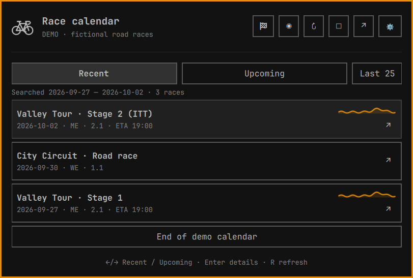
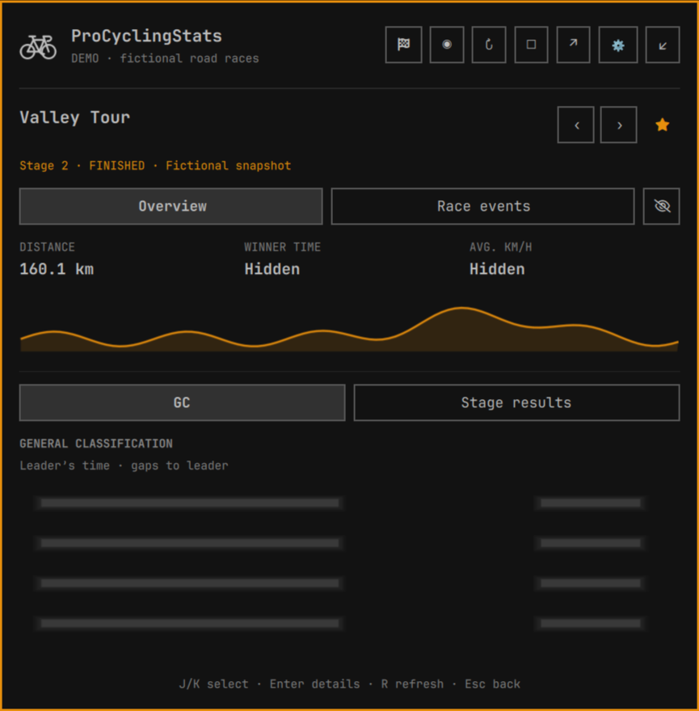
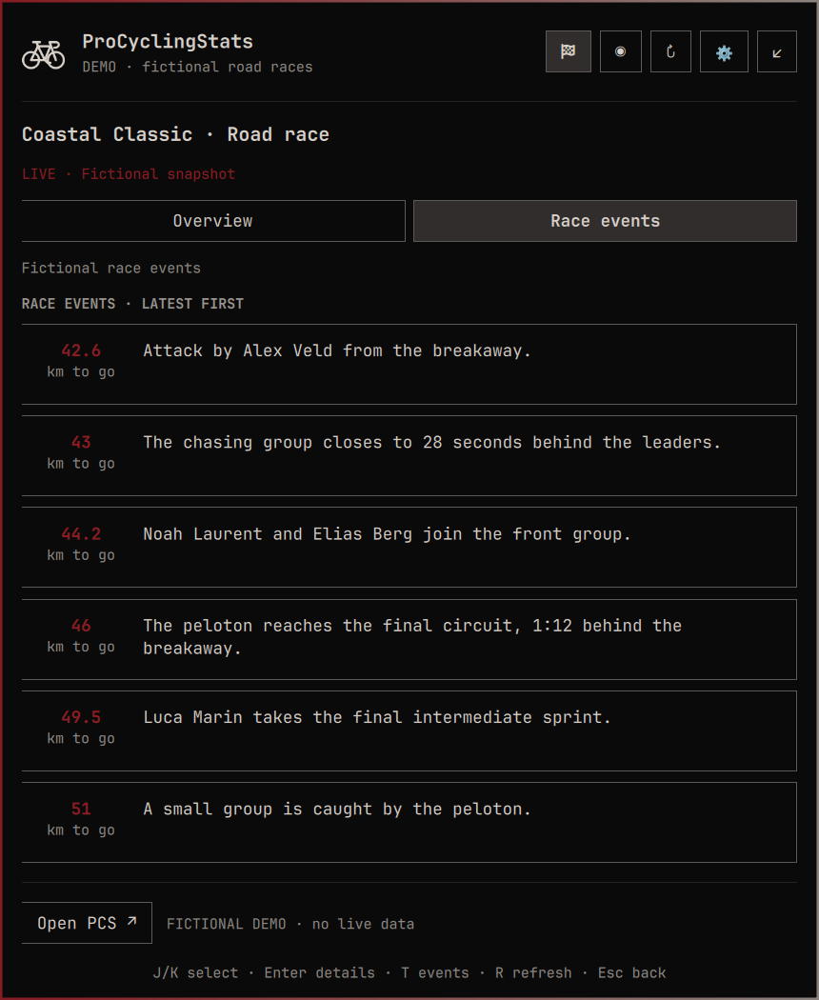

# ProCyclingStats for Omarchy

A road-cycling dashboard for the Omarchy Quattro bar. Follow live groups and
splits, browse race profiles, move between stages, and catch up on results
without spoiling the race you still want to watch.

**Unofficial integration.** Not affiliated with or endorsed by ProCyclingStats.
Coverage depends on the public data PCS makes available. No account or API key
is required.


*↑ gaining on the front · ↓ losing time. Hover a group to see the change in seconds.*

## Features

- **Live race situation:** groups and rider splits, distance remaining, race
  time, average speed, recent events and the next published climb or sprint.
  Gap trends compare fresh snapshots of matching groups against the same front.
- **Persistent pins:** star a race to sort it first within your current list and
  filters. Pins cover the whole edition, including its stages, and survive reboots.
- **Stage navigation:** previous/next arrows beside the title open published
  stages as results, live coverage or an upcoming preview. Your active tab stays selected.
- **Race calendar:** yesterday, today and tomorrow, plus Recent and Upcoming
  lists beyond adjacent days. Set the list size from 10 to 100 races in Settings.
- **Country flags:** race flags beside list and detail titles, rendered locally without image downloads. Country codes are retained with the seven-day course cache.
- **Profiles and results:** course outlines, distance and elevation gain for past, current and
  future races; finished-race results, stage GC, winner time and average speed.
  Profiles, distance and elevation gain are cached on disk for seven days.
- **Spoiler protection:** finished results and events stay concealed until you
  use the eye button. Profiles, distances, elevation and empty-state messages stay readable.
  Turn protection off entirely in Settings if preferred.
- **Your coverage:** filter by 13 race categories and minimum race level; choose
  refresh intervals and optional race-event notifications with automatic expiry.
- **Tiled pop-out:** detach into a regular desktop window and dock back without
  losing the current view. Polling and notifications remain shared.
- **Visible connection status:** failed or rejected updates show a warning and
  last-success information while keeping the previous snapshot available.

The bike icon sits in the center of the bar by default. Colors and typography
follow your Omarchy theme. Rider information appears in race context.

## Screenshots

Native captures from **v0.12.0**, using fictional races and riders. Click an image
to see it at full size.

| Race list with a pinned edition | Recent races with course profiles |
| --- | --- |
| [](screenshots/compact.png) | [](screenshots/calendar.png) |

| Stage navigation with results concealed | GC after revealing the results |
| --- | --- |
| [](screenshots/stage-navigation.png) | [](screenshots/gc.png) |

<details>
<summary>Upcoming preview, race events and filters</summary>

**Upcoming course**


**Race events**



**Category and level filters**


</details>

## Requirements

- **Omarchy 4 Quattro.** Locally tested with Omarchy **4.0.4-1** and Qt
  **6.11.2** under Wayland. Native captures also run in a multi-display session;
  compatibility with other versions and display arrangements is not exhaustive.
- **Python 3**, standard library only, available as `/usr/bin/python3`.
- **xdg-utils** for `/usr/bin/xdg-open`, used only when opening PCS in your browser.
- Network access to `https://www.procyclingstats.com`.

No account or API key is required. The plugin reads public HTML; it does not use
PCS’s API or bypass browser challenges. See [data access and permissions](docs/data-access.md).

## Install

Install from GitHub:

```sh
omarchy plugin add https://github.com/vip32/omarchy-procyclingstats --yes --enable
omarchy bar move io.github.vip32.procyclingstats --section center
```

The plugin ID is `io.github.vip32.procyclingstats`.

Update using the repository from which it was installed:

```sh
omarchy plugin update io.github.vip32.procyclingstats --yes
```

Omarchy normally reloads changes automatically. If QML remains cached, run
`omarchy restart shell`.

Disable or remove:

```sh
omarchy plugin disable io.github.vip32.procyclingstats
omarchy plugin remove io.github.vip32.procyclingstats --yes
```

Removal deletes the installed clone and its bar entry. Reinstalling uses default
settings and placement; preserve your widget entry first if you want to reuse it.
A separate source checkout and screenshots
exported by the developer demo remain yours. Course profiles and distances are
cached for seven days under `${XDG_CACHE_HOME:-~/.cache}/omarchy-procyclingstats/courses-v1`
(up to 100 entries / 32 MiB). This regenerable cache survives removal; delete the
`omarchy-procyclingstats` cache directory if you want to clear it immediately.
There are no stored credentials or background services outside the shell.

## Use

**Spoiler protection is on by default.** Finished races hide standings, winner
metrics and race events behind a blurred placeholder. Use the **eye button**
(or **S**) to reveal or hide the current race. The slashed eye means hidden;
the open eye means visible.
Switching races or closing the dashboard hides results again. Profiles and
distances stay visible. Empty tables, unavailable-event messages and missing
metrics remain readable; only populated results and events are concealed.
Finished-race event notifications are suppressed while protection is on. Disable **Spoiler protection** in Settings to show all results
normally and remove the reveal button. Opening PCS leaves the dashboard; the
external website can show results.

Click the bike, choose a date, then select a race. The calendar remembers your
last Recent or Upcoming tab, including after a shell restart. Overview/Race events
is remembered across races and restarts too. Each row has a ↗ icon that
opens that race or stage’s page directly on ProCyclingStats. Click a group to expand its
riders and bib numbers. Finished stages open on GC; switch to stage results when
needed. The header’s flag always returns to the race list; Live returns to today.

| Control | Action |
| --- | --- |
| Bike: left / right / middle click | Toggle popup or focus detached window / open PCS / refresh |
| Flag / `1` | Return to the full list for the selected date |
| Live indicator / `2` | Today’s live races |
| Calendar icon / `3` | Recent results and upcoming races |
| `←` / `→` in the list | Adjacent dates, or Recent / Upcoming in the calendar |
| Click the date | Return to today |
| Race-row ↗ | Open that race or stage on PCS |
| `J` / `K` or `↓` / `↑` | Select a race or setting |
| Enter / click a race | Open its details |
| `T` in race details | Overview / race events |
| Eye / `S` in finished-race details | Reveal / hide results and events |
| Header ↗ / `O` | Open the selected view on PCS |
| Window icon / `P` | Pop out to a desktop window / dock back to the bar |
| Gear / comma | Settings |
| `H` / `L` in Settings | Decrease / increase, uncheck / check |
| Enter in Settings | Toggle a category or adjust the selected setting |
| Star / `F` | Pin or unpin the selected race edition |
| `[` / `]` in details | Previous / next published stage |
| `D` / warning × | Dismiss the current warning banner |
| `R` | Refresh, respecting configured intervals and cooldowns |
| Esc | Back, then close |

The calendar applies your category and level filters before limiting the list.
Click a race for results/GC or its upcoming preview. Change the default count in
Settings. “Show more” expands this visit without changing your saved default. Multi-day races appear once,
using their nearest listed date and the race/stage link PCS publishes.

The pop-out is a normal Hyprland window: tile, move or resize it with your usual
window controls. Closing it keeps the current view; click the bike to reopen it.
Only one detached dashboard opens, and it uses the existing polling service.
The selected date/race, tab, expanded rider groups and scroll position survive
detaching and docking (scroll is clamped to the available range). Navigation
state lasts for the current loaded shell session; shell restart or plugin reload
resets it. Saved settings persist across restarts.

Pins apply within the selected date/calendar and category/level filters; they do
not fetch races outside that view or enable extra notifications. Up to 100 editions
can be pinned. Stage arrows appear only when PCS publishes the stage links;
no missing stage URLs are guessed. A stage change hides finished results again.

Settings save automatically to the widget’s entry in `~/.config/omarchy/shell.json`.
See [filters, refresh intervals and notifications](docs/settings.md).

## Data limitations

PCS coverage varies by race. Missing metrics show an em dash; unavailable riders,
GC, events or profiles are labelled explicitly. Published PNG/JPEG profiles use
the same inline graph when their outline can be traced reliably, with the original image as a fallback; unsupported formats or
missing coverage still require opening PCS. Start-time text is shown as published,
including its timezone; ETA means expected finish. Race position is never extrapolated. Finished-race time
is the published winner’s time for that race or stage, not accumulated GC time
or the live clock. Average speed is the published winner’s average.

Blocked or rate-limited access triggers a 15-minute cooldown. Previous data stays
visible with its timestamp and warning. Close the banner with **×** or **D**;
retries continue, and the bike indicator still reports the issue. Repeated retries
stay dismissed for this shell session; new or changed problems, or a failure
after recovery, show again. Changing HTML can require an adapter update.

## Development and support

Run `./tests/run` for portable validation and parser/model tests. QtTest adds
service tests when available. [Development and reproducible screenshots](docs/development.md)
describes the fictional demo and its restoration behavior.

Report reproducible issues through the Issues tab of the repository hosting this
checkout. Include the plugin version, Omarchy version, race URL and error shown;
omit private shell configuration. See [SECURITY.md](SECURITY.md) for sensitive reports.

[MIT license](LICENSE) · [Release notes](CHANGELOG.md) · [Submission preparation](docs/submission.md)
